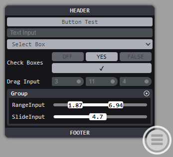

# PropPanel

<p>

This is my Property Panel mini library that I use to create UI's for my prototypes. Its primarily a collection of web component widgets that I've built that can be pieced
together to create UI. You use it like regular HTML Input Elements, so you can manage the events and data your own way.
<br><br><br><br><br><br><br><br><br><br><br>
</p>

### Get Started
```Shell
npm install
npm start
```

### Example
```Javascript
<script type="module">
    import * as PP from "../dist/bundle.js";

    window.addEventListener( "load", e=>{
        PP.Dom.on( "btnTest", "click", false, e=>console.log( "Button - " + e.srcElement.id ) );
        PP.Dom.on( "dniTest", "input", false, e=>console.log( "DragInput - " + e.detail.value ) );
        PP.Dom.on( "rngTest", "input", false, e=>console.log( "RangeInput - %d %d", e.detail.min, e.detail.max ) );
        PP.Dom.on( "siTest", "input", false, e=>console.log( "SlideInput - %d", e.detail.value ) );
    });
</script>

<prop-panel-btncont open="true" panelWidth="300px">

    <prop-panel head="HEADER" foot="FOOTER">
        <button id="btnTest">Button Test</button>
        <input type="text" value="Text Input" >
        <select><option>Select Box</option><option>b</option></select>

        <prop-row label="Check Boxes"> <flex-stack row="3">
            <check-button class="onoff" on="false"></check-button>
            <check-button class="yesno"></check-button>
            <check-button class="tf" on="false"></check-button>
            <check-button class="check"></check-button>
        </flex-stack> </prop-row>

        <prop-row label="Drag Input"> <flex-stack row="3"> 
            <drag-number-input id="dniTest"></drag-number-input> 
            <drag-number-input></drag-number-input> 
            <drag-number-input></drag-number-input> 
        </flex-stack> </prop-row>

        <prop-group label="Group">
            <prop-row label="RangeInput"><range-input id="rngTest"></range-input></prop-row>
            <prop-row label="SlideInput"><slide-input id="siTest"></slide-input></prop-row>
        </prop-group>
    </prop-panel>

</prop-panel-btncont>
```
